#HSLIDE

## За свободата, програмиста и развитието


#HSLIDE
### Кой съм аз?

* Аз съм Николай/Meddle. |
* Програмирам сървъри и инфраструктура |
* Работя във ВИК-то |
* Част съм от elixir-lang.bg |
* И други неща... |

#HSLIDE
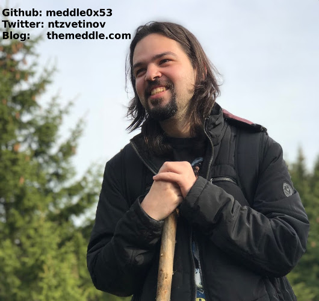

#HSLIDE
### Кои сте вие?

* Хора с различни интереси в софтуера, а може би и в хардуера? |
* Хора, които чакат последната лекция и закриването и не са си харесали нещо в другите зали? |
* Или пък се познаваме?? |
* Честно казано, не очаквам да сте много :) |

#HSLIDE


#HSLIDE
### За какво иде реч


#HSLIDE
### За какво иде реч
* Веднъж един голям философ, философстваше как много програмисти не знаели някакви основни неща и не им пукало |
* Не им било интересно да задълбават |
* Имали си по-интересни неща в живота, както и C# |

#HSLIDE
* И аз си казах, че си имам по интересни неща в живота, и все пак имам любопитство и желание да знам разни неща |
* Някои хора нямат любопитство, за тях работата е работа |
* В това няма лошо! |

#HSLIDE
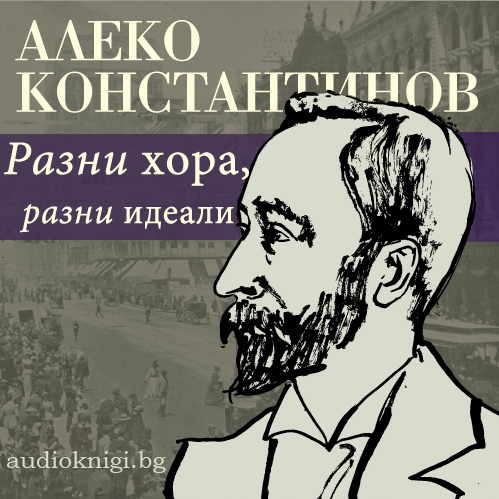


#HSLIDE
* Зависи какво и как ви се работи |
* Философска работа! |
* Та, ако няма желание за професионално развитие, няма лошо, ваш си проблем |
* Или нечий друг, или няма проблем |


#HSLIDE
### Основи

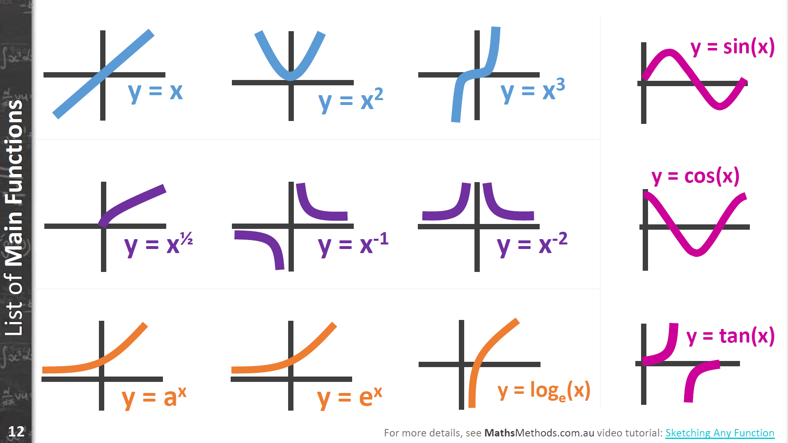

#HSLIDE
### Основи
* Какво правиме всъщност?
* Главно пишем и поддържаме програми |

#HSLIDE
### Основи
* Какво представляват програмите?
* Поредица от инструкции към машина, четат се данни, преработват се, връща се резултат |
* Вход-изход |
* Функции |


#HSLIDE
### Основи
* Има ли математика тук?
* Има. |

#HSLIDE
### Основи
* Трябва ли ни математика за да си вършим работата?
* Не. |
* Обаче помага! |

#HSLIDE
### Основи
* Има ли един добър начин за писане на програми?
* Не. |
* Има много, някои са подходящи за едни хора, други за други, някои за един тип програми, други за друг... |
* Затова има толкова много езици за програмиране, библиотеки и концепции |

#HSLIDE
### Основи
* Какво ни трябва за да напишем всяка програма за която се сетим?
* x или променливи |
* λx.N или абстракции |
* (M N) или апликации |


#HSLIDE
### Основи
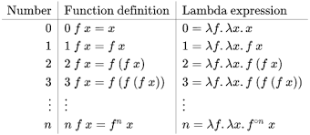

#HSLIDE
### Чуденки
* Къде са if-овете? |
* Къде са циклите? |
* Къде са скобките и блоковете? |
* Къде са ми типовете?! |


#HSLIDE
### Истината е някъде там
Къде са if-овете?
```
λx.λy.x
λx.λy.y

λp.λa.λb.p a b
```

#HSLIDE
### Истината е някъде там
Къде са циклите?

```
λf.(λy.f(y y))(λy.f(y y))
```

#HSLIDE
### Истината е някъде там
Къде са скобките и блоковете?

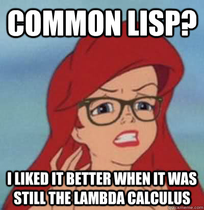

#HSLIDE
### Истината е някъде там
Къде са ми типовете?! |

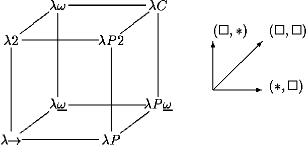


#HSLIDE
### Шегуваш ли се?
* Не. |
* За да станем по-добри в това, което правим, е добре да сме запознати с основите |
* Стъпка в друга подобна посока е да имаме идея как работят компютрите |
* Как работят компилаторите, GC, различни bytecode машини, и тн |

#HSLIDE
### Как?
* Можем да четем книги, статии и разсъждения по темите |
* Можем да слушаме хора по темите |
* Можем да разучаваме, разсъждаваме, създаваме и пишем по темита |
* Твърдя, че помага, макар и да изисква усилие |

#HSLIDE
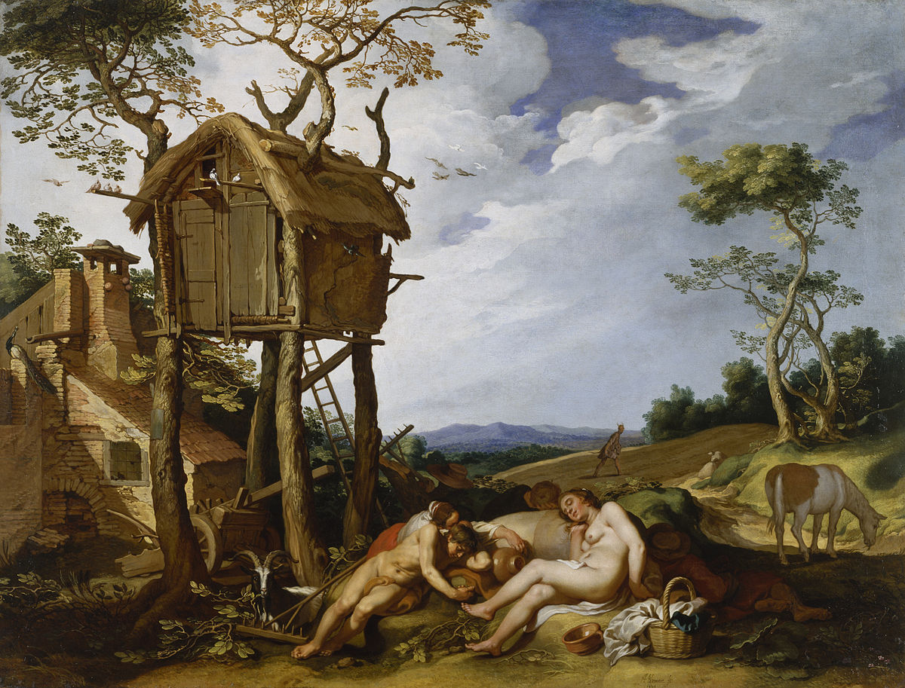

#HSLIDE
### Книги
* По добре да са книги на тема идеи, отколкото книги на тема преходни технологии |
* Всичко е преходно, но някои неща са основа за други... |


#HSLIDE


#HSLIDE
* Освен книгите има и различни статии по отношение на основите на езиците за програмиране
* Помагат да пишем по опростени и лесни за четене програми |
* Помагат даже при езици като Java и C# |
* Напоследък концепции за качествен код, известни от много-много години се пишат като нови, велики идеи... |

#HSLIDE
* А знаете ли, че обектно-ориентираното програмиране и функционалното програмиране не са взаимно противоречащи си концепции?
* Можете да имате обектно-ориентиран език изграден над функционален език! |
* Макар и известните обектно-ориентирани езици да са върху императивни |

#HSLIDE
* Като цяло езиците, които се водят мулти-парадигмени са лесни за усвояване и разширяват кръгозора ни |
* Смислено е да се учат различни езици, не е губене на време |
* Разширеният кръгозор, разширява инструментариума ни за решаване на проблеми |

#HSLIDE


#HSLIDE
### Типове, типчета и типажи
* А за типовите системи, винаги се е говорило за тях?
* Статични vs Динамични, динамично-типизирани vs статично типизирани? |
* Няма безплатни неща, истината е някъде по средата, хубаво е да пробваме различни неща, така ще намерим най-добре себе си. |

#HSLIDE
### Типове, типчета и типажи
* А силно-типизирани vs слабо-типизирани?
* Знаете ли разликата? |
* Разлики има, и това знание не е напразно, много бъгове биха могли да се намерят по-лесно ако си познавата езиците. |

#HSLIDE
```javascript
"5" + 4
//=> "54"

[] + 0
//=> "0"

{} + 4 // !!
//=> 4
```

#HSLIDE


#HSLIDE
```cpp
#include <string>
#include <iostream>

using namespace std;

int main() {
  string s = "bla";
  s += 83;

  cout << s << endl;
}

//=> blaS
```

#HSLIDE
В Erlang това ще доведе до грешка:

```erlang
5 + "4".
```

#HSLIDE
* Това прави Erlang динамично и силно типизиран, както и Elixir, Ruby и Python.
* Примери за статично и силно типизирани езици са Rust, Java, Haskell.

#HSLIDE
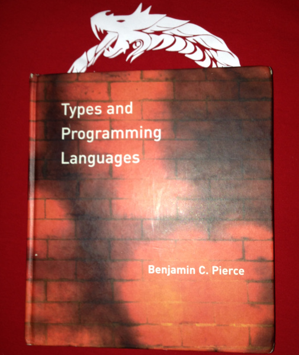

#HSLIDE
### Имплементации
* Как са имплементирани езиците?
* Как работи паметта, GC, процесора, абстрактните машини? |
* За тези неща не мога да ви препоръчам книги, пробвал съм много, но документации и код вършат по-добра работа... |


#HSLIDE
### Имплементации
* Такова знание ще ви помогне да разберете как работят самите ви инструменти
* Ще ви накара да пишете по-бързи и не-бъгави програми |
* Аз често поглеждам към https://github.com/happi/theBeamBook |

#HSLIDE
### Интереси

* След основите, си следвайте интересите |
* Аз имам интереси в конкурентни модели и дистрибутирани системи, което ми помага в работа |
* Както видяхме се вълнувам и от типови сестеми и функционално програмиране... |

#HSLIDE
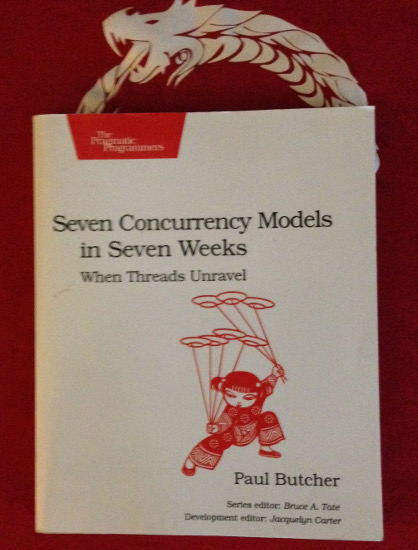

#HSLIDE
### Интереси
* Развивайте си интересите, които ще ви направят по-добри в избраната от вас посока
* Ако се занимавате с финанси, прочетете нещо за финанси |
* Ако се занимавате с банки, прочетете нещо за банково дело |
* Домейнът има значение и това ще е оценявано |

#HSLIDE
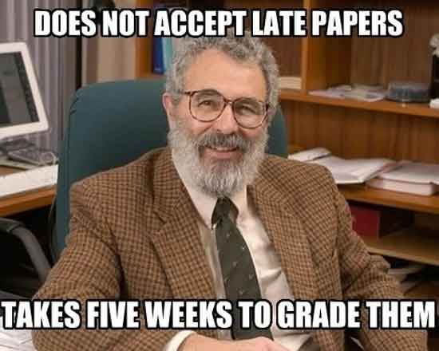

#HSLIDE
### Алгоритми
* Това, че са ви имплементирани разни неща в езика, не означава, че не трябва да имате идея как работят |
* Когато четем как нещо работи го добавяме към знанията си, когато попаднем на сложен проблем, колкото повече pattern-на имаме, толкова по лесно ще го решим |
* На мен ми напомня като трупане на exp в RPG |

#HSLIDE
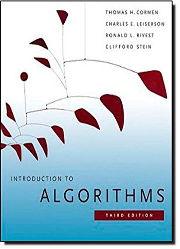

#HSLIDE
### Четенето води до писане

* Четенето е добро начало! |
* Но писането е това, което помага наистина |
* Научете нещо, като напишете нещо. |

#HSLIDE
* Направете си блог и пишете в него - ще ви накара да си съберете мислите и да посъберете повече информация
* Напишете библиотека, нещо практично, а защо не компилатор! |
* Писането на книги е друга работа и не е за всеки... Но ако е за вас - доста труд ще е и сигурно ще си струва |

#HSLIDE
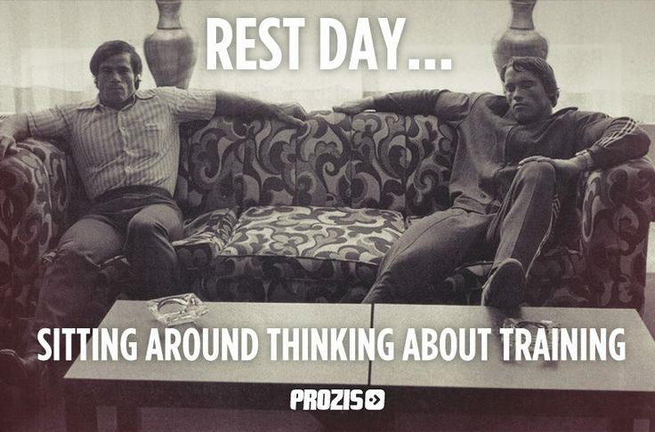

#HSLIDE
* Направете нещо open source, което ви трябва сега
* Може и да помогне на някого друг |
* Някой друг може да го разшири с нещо полезно |
* Може и да изгние в забрава... |

#HSLIDE
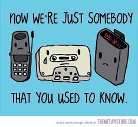

#HSLIDE
* Четете си стария код
* От една страна, ще ви е лесно, защото си е ваш |
* От друга ще си припомните нещо забравено |
* От трета може и да се почувствате добре в тъжен ден |

#HSLIDE


#HSLIDE
### Мързел
* Използвайте си мързела във ваша полза |
* Мързелът води до гениални решения |
* Но всичко в големи дози може да ви убие, даже нещата даващи живот! |

#HSLIDE
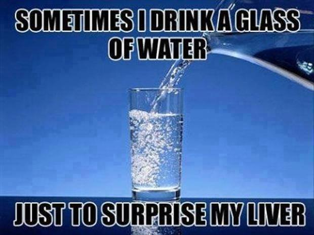

#HSLIDE
### Програмистът и обществото
* Обществото може да е полезно |
* Мен ми е полезно да чета фейбук групата dev.bg, защото имам нужда да се посмея |
* Както и коментари под статии в dir.bg |

#HSLIDE
### Програмистът и обществото
* Да речем, знаете ли за детето на програмиста?! Важно знание |

#HSLIDE


#HSLIDE
### Програмистът и обществото
* Връзките с разни хора от индустрията вършат работа |

#HSLIDE
### Програмистът и обществото
* Вършат работа да си намерим работа |
* Вършат работа да си решим някой проблем |
* Вършат работа да си намерим правилния колега |
* Човекът е социално животно |

#HSLIDE
Вършат работа да има някой в залата, като правиш презентация на Open Fest
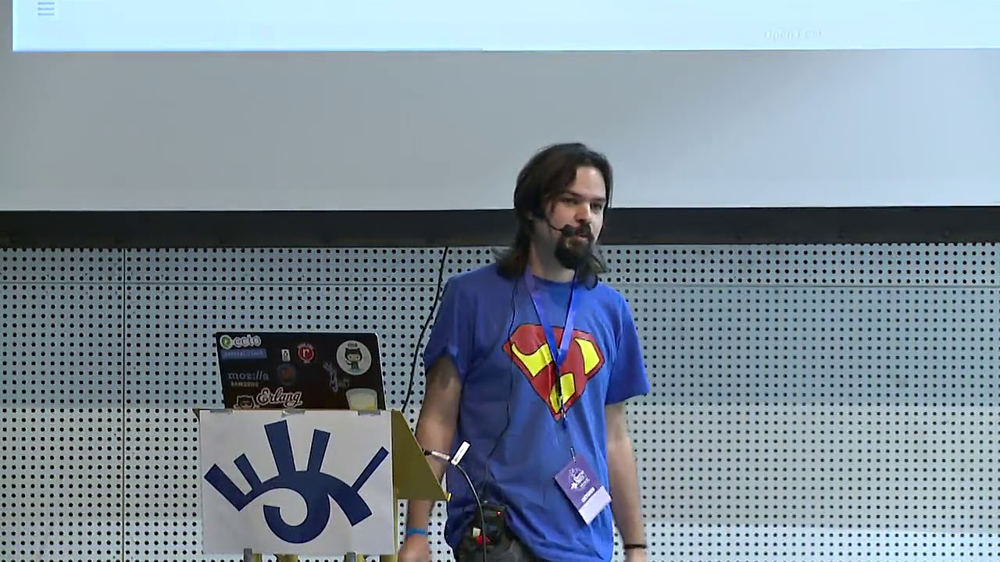

#HSLIDE
### Връзкарство
* Конференциите са хубаво място да се запознаеш с разни ценни индивиди
* И може и да научиш нещо, междувременно |
* И да видиш разни стари муцуни |


#HSLIDE
### Конференциите
* Може да чуем за нещо и после да прочетем за него с подробности |
* Аз намерих любимата си технология по този начин |
* Което доведе и до текущата ми работа |

#HSLIDE
### Конференциите
* Има специализирани конференции като partial::conf, Balkan Ruby, React Not-A-Conf
* Има по-широко тематизирани - Open Fest и турнето, да речем
* Струва си да ги посещаваме

#HSLIDE
### Конференциите - минуси
* Време |
* Политики и връзки... |
* Знаещи хора, които не ги бива да презентират... |
* Незнаещи хора, които заемат slot поради точка 2 |

#HSLIDE


#HSLIDE
### Конференциите
* А защо и да не пробваме да говорим за тях |
* Пак ще ни накара да си съберем мислите, да попрочетем неща и да упражним и други умения |
* Освен ако не говорите общи приказки, като мен |

#HSLIDE


#HSLIDE
### Meetup-и и други такива
* Като конференциите, но още по-тясно ориентирани |
* По-чести са, и темите може да са ви по-интересни |
* Говоренето в тесен кръг е по-лесно за някои |

#HSLIDE


#HSLIDE
### Курсове
* Обикновено специалисти по дадена тема ги водят |
* По надълбоко се гмуркаме в материята |
* Ще се наложи да правим нещо за да го вземем |

#HSLIDE
### Курсове
* На повечето избираеми курсове във ФМИ няма да ви изгонят, даже ще ви се радват |
* Избираемите курсове във ФМИ си струват |
* Има и online, но не съм запознат |

#HSLIDE
### ФМИ
* Помните ли разните математики, за които не можехме да чатнем защо ги учим? |
* Е, попрочетете някакви неща сами, има смисъл, просто тия дето ги преподават са от точка 3 или точка 2 |
* Пример - Висша алгебра |

#HSLIDE
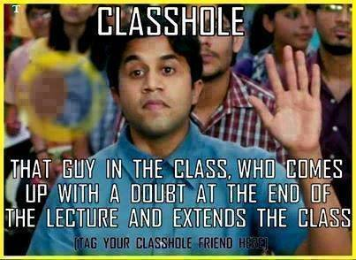

#HSLIDE
### Академии
* Нямам мнение |
* Не искам да имам мнение |
* Не ме питайте за мнение |

#HSLIDE
## И така
* Ако вдигаш level нещата стават по интересни |
* Но хората са различни, някои искат да превъртят живота на 1-ви level |
* Някои успяват |
* Повечето не. |

#HSLIDE


#HSLIDE
### И така
* Knowledge leads to ideas |
* Ideas lead to inventions |
* Inventions lead to better life |
* Add more points to intelligence! |
* Luck is important too... |

#HSLIDE


#HSLIDE
## Защо не разцъкаме малко Haskell за здраве, тогава?

#HSLIDE


#HSLIDE
## Край

* https://twitter.com/ntzvetinov
* http://themeddle.com


#HSLIDE
### Вместо въпроси:
* Какво работя и и какво ползвам?
* Какви са моите интереси?
* Какви ресурси бих препоръчал по темата?
* Сами ли сме в космоса и ако не, извънземните цъкат ли Haskell?
