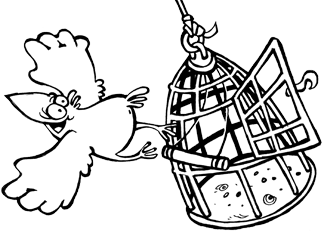
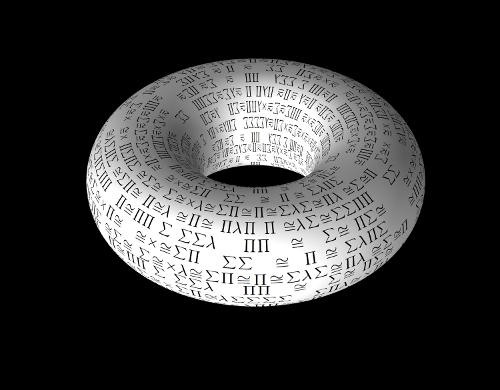
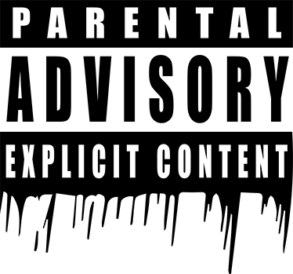
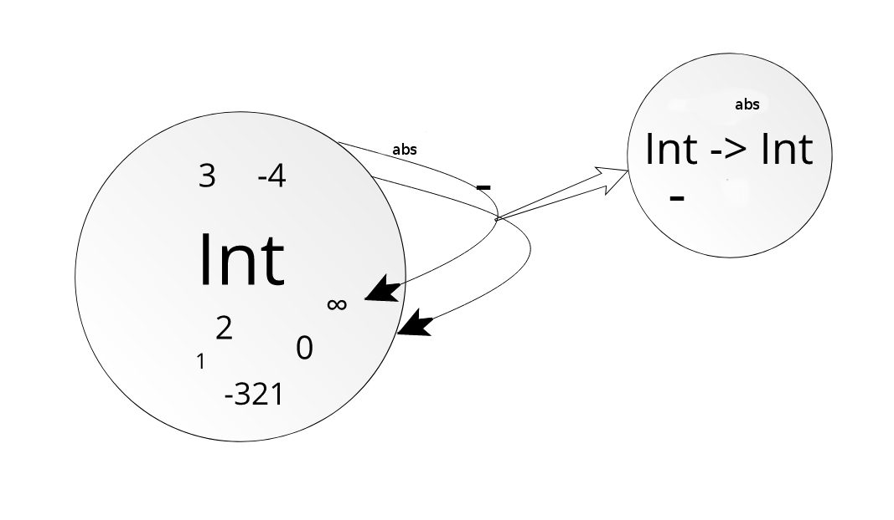
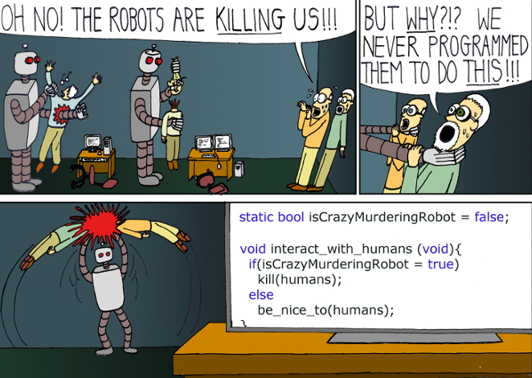
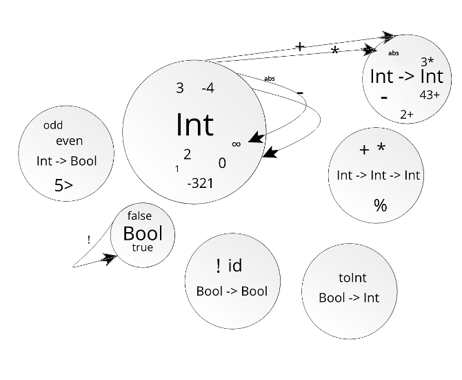

#HSLIDE

## Типове, типчета и типажи


#HSLIDE


#HSLIDE
### Кой съм аз?

* Аз съм Николай/Meddle. |
* Програмирам сървъри и инфраструктура |
* Работя във ВИК-то |
* Част съм от elixir-lang.bg |
* И други неща... |

#HSLIDE


#HSLIDE
### DISCLAIMER


#HSLIDE
### Кои сте вие?

* Хора с различни интереси в софтуера, а може би и в хардуера? |
* Или не ви е интересно да тествате големи промени в големи данни? |
* Или пък се познаваме?? |
* Честно казано по това време не очаквам да сте много :) |

#HSLIDE


#HSLIDE
### Началото


#HSLIDE
### Началото
Програмирането идва от математиката и развива математиката, отива в математиката,
защо ни е страх от математиката?

#HSLIDE
* През 30те години, Алонсо Чърч представя ламбда смятането - универсална нотация за решаване на проблеми |
* Ламбда смятането минава през няколко допълнения и предефинирания |
* През 1940 година Чърч измисля ламбда смятането с прости типове (simply typed lambda calculus) |
* Така дефинира една доста проста типова система |

#HSLIDE

* И преди това има идеи за използване на типa на данните при дефиниране на нотации за решаване на проблеми
* Няма да се занимаваме със суха математика, ще използваме ламбда смятането с прости типове като отправна точка |
* Ще използваме примери от модерни езици за програмиране |


#HSLIDE

```
e ::= x | λx:τ.e | e e | c
```

#HSLIDE
### Дефиниции и класификации


#HSLIDE
"Статично типизирани" и "динамично типизирани" езици

* Езици със статична проверка на валидността на типовете в програмата, проверяват тази валидност по време на компилация |
* При тях често трябва, при дефиниции на променливи и функции, да задаваме типа |
* Динамични са езици, в които валидността на данните се проверява (или не) по време на изпълнение |

#HSLIDE
"Статично типизирани" и "динамично типизирани" езици

* Примери за статично типизирани  : Haskell, C++, Java, ML-езиците като OCaml, StandartML, Rust и F# и други |
* Примери за динамично типизирани : Erlang, Elixir, JavaScript, Python, Ruby, Common Lisp, Clojure и други |
* Кои са по добри? |

#HSLIDE
"Силни" и "слаби" типове

* При езиците със слаби типове, операции между различни типове са възможни.

#HSLIDE
```javascript
"5" + 4
//=> "54"

[] + 0
//=> "0"

{} + 4 // !!
//=> 4
```

#HSLIDE


#HSLIDE
```cpp
#include <string>
#include <iostream>

using namespace std;

int main() {
  string s = "bla";
  s += 5;

  cout << s << endl;
}

//=> bla
```

#HSLIDE
В Erlang това ще доведе до грешка:

```erlang
5 + "4".
```

#HSLIDE
* Това прави Erlang динамично и силно типизиран, както и Elixir, Ruby и Python.
* Примери за статично и силно типизирани езици са Rust, Java, Haskell.

#HSLIDE
### Основите

* Алонсо Чърч смята типовете за съществена (intrinsic) част от семантиката (смисъла) на езика. |
* Без типовете зададени като част от изразите езика би се държал неопределено или безмислено. |
* Можем да кажем, че програмата без зададени типове не би могла да се компилира, защото не би имала смисъл за компилатора. |

#HSLIDE
### Основите

* От друга страна ги има и типовете на Хаскел Къри, също известни като несъществени (extrinsic) типове. |
* Тези типове не са част от семантиката на езика, а имат смисъл при самото изпълнение на програмата. |

#HSLIDE
### Основите

* Интересно е, че от толкова рано в развитието на типовете ги има тези две идеи.
* В по-развитите типови ситеми, типовете често не се задават при повечето изрази, защото системата може да си ги изведе (inference).
* Така, че може да се каже, че истината е някъде по средата.

#HSLIDE
## От бяло платно до типова система

#HSLIDE


#HSLIDE
### Какво представляват програмите?

* Логика, използваща входни данни, преобразуваща ги или смятаща резултат на база тези данни, накрая връщаща резултат. |
* Живее дълго или кратко, но в крайна сметка работи с данни. |
* Информацията има форма и свойства. |
* Трябва да знае за формата и свойствата, за да знае, какво е възможно да се изпълни върху данните. |

#HSLIDE
### Език


#HSLIDE
### Език

```
e ::= x | λx:τ.e | e e | c | c:τ | let x:τ in e | ...
```

#HSLIDE
### Език

* Имаме си езика, нека е статично типизиран засега, но ще разгледаме и няколко динамични примери. |
* Нямаме никакви типове, имаме бяло платно от типове, нашата работа е да си ги добавим. |
* И добавяйки ги, ще даваме примери на различни езици, ще разширяваме началния си синтаксис. |

#HSLIDE

```haskell
value :: T

-- Или нещо такова:

let x = value :: T in x
```

```rust
let x:Т = value;
```

```java
T x = value;
```

#HSLIDE
### Език
* Имаме синтаксис, нямаме типове - бяло платно. |
* На това бяло петно от възможните типове, ние можем да дефинираме числата. |
* Множеството от възможни типове на нашите езици е като множество от множества. |
* Като всеки елемент на това 'множество от типове' е множество съдържащо всички възможни стойности за даден тип |


#HSLIDE
### Числа


#HSLIDE
### Числа

```java
int x = 5;
```

```haskell
5 :: Integer
```

#HSLIDE
### Числа
* Няма значение как е дефиниран типът, важното е, че го има. |
* Това значи ли, че нашият език може да работи с данни от тип цели числа? |
* Не! |
* Защото не сме си дефинирали възможните операции над типа цели числа. |

#HSLIDE
### Операции над числа
* Нека да си дефинираме операцията за промяна на знака : '-'.
* Това е операция, която взима число и връща число с обърнат знак:

```haskell
let x = 4 :: Integer in -x
-- => -4
```

#HSLIDE


#HSLIDE
### Операции над числа
* Няма значение имплементацията на числата, това е функция.
* Операция, която взима число и връща число с обърнат знак:

```rust
let negate = |n: i32| -> i32 { -n };
let val: i32 = 84;

println!("{}", negate(val));
// => -84
```

#HSLIDE
### Операции над числа
* Можем да си представим функцията като някаква трансформация/стрелка излизаща от множеството на числата и връщаща се пак в него.
* От стойност от множеството Int получаваме стойност в множеството Int. |

#HSLIDE


#HSLIDE
### Операции над числа

* Но в примера, ние си дефинирахме променлива 'negate', със стойност функцията за обръщане на знака.
* Какъв е типът на тази стойност?

```rust
let negate: fn(i32) -> i32 = |n: i32| -> i32 { -n };

// По нотацията за променлива и тип в Rust:
// let x: T = value;
// Или тук имаме let x: fn(i32) -> i32 = value;
```

#HSLIDE
### Операции над числа

```cpp
#include <functional>
#include <iostream>

using namespace std;

int main() {
  function<int(int)> negate = [](int n) -> int { return -n; };
  // function<int(int)> е функция,
  // която връща int и има един аргумент от тип int.

  int x = 56;
  cout << negate(56) << endl;
}
```

#HSLIDE
### Операции над числа
* Функциите от типа 'Int -> Int' са стойности на този тип.
* Тип, който можем да наречем 'функции взимащи число за параметър и връщащи число'. |
* Това означава, че всички стрелкички от типа Int към типа Int са стойностите в нашето множество от типове. |

#HSLIDE


#HSLIDE
### Операции над числа
* Действията са вид данни.
* Можем да си дефинираме стойности от типа 'функции взимащи число за параметър и връщащи число' използвайки синтаксиса на езика.
* Това ни дава възможност за абстракции.
* В императивни езици като C++ и Java това не беше възможно преди време.

#HSLIDE
### Операции над числа
* Защо в миналото нямаше функции-като-стойности в обектно-ориентирани езици като Java?

#HSLIDE
### Операции над числа
* Какво са класовете в тези езици? Класовете задават структура, по която се създава обект. Нещо като нов тип...

#HSLIDE
### Операции над числа
* Какво са обектите в тези езици? Данни, които могат да променят състоянието си, с операции вързани към тях. Тези операции имат достъп до тези данни, затворени в обекта. Можем да си предаваме обекта насам-натам, предавайки неговите операции и данни.

#HSLIDE
### Операции над числа
* Какво са анонимните функции (ламбдите)? Функции, които може да са обвързани с данни, дали от средата в която са дефинирани, или от начина, по който са построени, които можем да си предаваме насам-натам.

#HSLIDE


#HSLIDE
### Операции над числа

* Можем да имаме безкрайно много функции от типа 'Int -> Int'.
* Но какво да кажем за функции на два аргумента като събирането?

```ocaml
let plus a b = a + b;;

plus 4 5;;
- : int = 9
```

* Ако разгледаме типа на тази функция, той всъщност излиза като `plus : int -> int -> int`, или `Int -> Int -> Int`.

#HSLIDE
### Операции над числа

```java
import  java.util.function.*;

public class Funcs2 {
  public static void main(String[] args) {
    BiFunction<Integer, Integer, Integer> plus = (a, b) -> a + b;
    Function<Integer, Function<Integer, Integer>> pluss =
      (a) -> (b) -> a + b;

    System.out.println(plus.apply(1, 2));
    // => 3
    System.out.println(pluss.apply(1).apply(2));
    // => 3
  }
}
```

#HSLIDE
### Операции над числа

* Идеята е че за функции от типа 'Int, Int -> Int' можем да кажем, че имат тип 'Int -> Int -> Int'. |
* В езици като Haskell си има 'синтактична захар' за маскиране на това и винаги имаме функции на просто един аргумент. |
* Известно е като 'currying' и идва от името на  Хаскел Къри. |

#HSLIDE


#HSLIDE
### Операции над числа
* Аналогично е за функции на множество параметри числа, връщащи число.
* Типовата система е съвкупност от множества със стелки между тях. |
* Можем да моделираме типовата система както на статично-типизирани, така и на динамично-типизирани езици. |
* Не указваме, дали проверяваме типовете по време на компилация или по време на изпълнение. |

#HSLIDE
### Още основни типове


#HSLIDE
### Още основни типове

* Ако типовете са множества, кой често използван тип би бил множество със само два елемента?
* Това е булевият тип Bool. |
* Има само две стойности true и false. |

#HSLIDE


#HSLIDE
### Още основни типове
* С Bool можем да добавим още типове, като 'Bool -> Bool', член на който е функцията 'not'. |
* Или типа 'Bool -> Bool -> Bool', член на който са 'and' и 'or'. |
* Типa от функции 'Int -> Bool', да речем 'even' и 'odd'. |
* Kакто и 'Int -> Int -> Bool', като '>' и други. |
* Безкрайно много типове. |

#HSLIDE


#HSLIDE
### Още основни типове
* Често използван тип само с един елемент? |
* Това би бил типът известен като 'unit' (в някои езици 'void'). |
* Той има една единствена стойност, често представяна като '()'. |
* Този тип е интересен, защото ни позволява да си дефинираме функции, които връщат стойност, без да взимат стойност. |

#HSLIDE
### Още основни типове
* При използване на клоужър функции върнати от други функции, такова нещо има смисъл.

```ocaml
let f () = 5;;
val f : unit -> int = <fun>
```

#HSLIDE
### Още основни типове
* Разбира се може да има множество типове с по две стойности или само с по една стойност.
* Ние разглеждаме типове, с които езиците често идват "опаковани".
* А има ли празен тип? Има празно множество, защо да няма тип без стойности?

#HSLIDE
### Още основни типове
* В Rust можем да си дефинираме функция със следния тип:

```rust
let junk: fn(i32) -> ! = |_: i32| -> ! { panic!() };
```

* Типът е 'fn(i32) -> !', което означава, че това е функция, която никога не връща резултат.

#HSLIDE
### Още основни типове
* В 'Haskell' можем да си дефинираме:

```haskell
data Empty
```

* Това са примери за типа без стойности, известен като 'Bottom' или '⊥'.
* Функциите при програмирането не са математически функции.
* Можем да го приемем като под-множество на всеки друг тип.

#HSLIDE
### Алгебра и типове


#HSLIDE
### Алгебра и типове
* При функционалните езици, данните са непроменими, което прави възможно дефинирането на алгебрични типове данни.
* Типове от данни съставени от други типове от данни : съставни типове.

#HSLIDE
### Продукт


#HSLIDE
### Продукт

* Има множество типове-продукти .
* Да речем в Elixir имаме tuple типовете:

```elixir
{1, 4}
```

#HSLIDE
### Продукт
* Това е тип, който е съставен от два различни типа. |
* Може да има толкова стойности колкото стойностите на тип1 умножени по стойностите на тип2. |
* Можем да го представим и като декартово произведение на множества в нашата типова система. |

#HSLIDE
### Продукт

* Обикновено продуктовите типове имат две функции:

```haskell
fst :: (a, b) -> a
fst (x, y) = x

snd :: (a, b) -> b
snd (x, y) = y
```

#HSLIDE
### Продукт
* Ако си ги представим като стрелки, fst ще сочи от продуктовия тип към типът на първия елемент на двойката, а snd към втория. |
* Можем да си дефинираме класове Pair за да постигнем подобен тип в Java или C++. |
* Можем да имаме и продукти от по три, четири, N типа. |

#HSLIDE


#HSLIDE
#### Сума


#HSLIDE
#### Сума
* Типът сума се среща също често:

```haskell
data Either a b = Left a | Right b
type BoolInt = Either Bool Integer

Left True :: BoolInt
Right 5   :: BoolInt
```

#HSLIDE
#### Сума
* При BoolInt стойности от ляво могат да са всички възможни Bool стойности (2), а от дясно всички възможни числа : N(Int). |
* В даден момент стойност от този тип може да е или Left val или Right val. |
* Общо възможните стойности в BoolInt са 2 + N(Int). |

#HSLIDE
#### Сума
* Във функционалните езици имаме pattern matching. |
* Така можем да си дефинираме функция, която приема стойност от сумарен тип и спрямо от кой от съставните му типове е съответната стойност, се изпълнява определена имплементация. |
* Можем да си представим процесът като стрелка от тип A към сумарен тип A | B и още една стрелка от тип B към сумарен тип A | B. |

#HSLIDE
#### Сума

```haskell
falsy :: BoolInt -> Bool
falsy (Left False) = True
falsy (Left True)  = False
falsy (Right 0)    = True
falsy (Right _)    = False
```

#HSLIDE
#### Сума

* Друга известна сума е Maybe:

```haskell
data Maybe a = Just a | Nothing
```

* Тук Nothing е единствената стойност на тип - нищо.

#HSLIDE
```rust
enum Either {
    Left(bool),
    Right(i32)
}

let val = Either::Left(true);
match val {
    Left(false) => true,
    Left(true)  => false,
    Right(0)    => true,
    Right(_)    => false
}
```

#HSLIDE
#### Сума
* enum в Rust не е същото като енумерациите в C++ и Java. |
* Всъщност дефинира tagged union или това, което наричаме сумарен тип. |

#HSLIDE
#### Сума
```elixir
@spec falsy(val :: boolean | integer) :: boolean
def falsy(false), do: true
def falsy(true), do: false
def falsy(0), do: true
def falsy(n) when is_integer(n), do: false
```

#HSLIDE


#HSLIDE
#### Експоненти


#HSLIDE
#### Експоненти
* Функциите представяхме като стрелки от тип към тип. |
* Но даден тип стрелки, тип функции, също образуваше тип. |
* Често наричаме тези функции-типове експонентни типове. |

#HSLIDE
#### Експоненти
* Пример, колко стойности има типа Bool -> Int?
* Всяка такава функция има две поведения - при true и при false и при двете връща някакво число. |
* За всяка от Bool стойностите имаме толкова стойности, колкото имаме стойности в Int типа. |
* Или общо N(Int) x N(Int)... |

#HSLIDE
### Рекурсивни типове


#HSLIDE
### Рекурсивни типове
* Досега си добавяхме типове, допълващи ламбда смятането с прости типове. |
* При дефиниране на нещо в ламбда смятането с прости типове, то задължително се изпълнява с резултат. |
* Този език е ограничен. С него не можем да изразим всякаква програма. |
* Сега ще си добавим още едно допълнение : рекурсивни типове. |

#HSLIDE
### Рекурсивни типове

```ocaml
type intlist = Nil | Cons of int * intlist;;
```

```haskell
data Tree a = Leaf a | Node (Tree a) (Tree a)
```

#HSLIDE
### Рекурсивни типове
* И в Rust, Java, C++ можем да си дефинираме типове/класове, които имат полета от тип себе си.
* Типът 'списък от числа' и типът 'списък от булеви стойности' са различни множества.

#HSLIDE
### Записи, речници и произволни типове


#HSLIDE
#### Записи

* Някои езици ни предоставят записи (records), това са tuple типове, като всеки елемент на произведението е с етикет - име.
* По този начин можем да си правим собствени типове:

```erlang
-record(person, {name = "", id}).
```


#HSLIDE
#### Речници

* Друга структура, която можем да ползваме за произволни типове е речника. |
* Повечето езици идват с такива типове, които в зависимост от езика могат да бъдат имплементирани с mutable или immutable структура - хешмап, трай, други. |
* В доста езици имаме и структури, които са именовани речници представляващи такъв тип. |

#HSLIDE
#### Речници
```elixir
defmodule Person do
  defstruct [:age, name: ""]
end

dali = %Person{name: "Dali", age: 4}
#=> %Person{age: 4, name: "Dali"}

inspect(dali, structs: false)
#=> "%{__struct__: Person, age: 4, name: \"Dali\"}"
```

#HSLIDE
#### Произволни типове
* В обектно-ориентираните езици обикновено има класове, но можем да си ги представиме като такива структури, криещи състоянието си.
* Някои от ключовете им - полета са скрити, други сочат към функции, имащи достъп до скритото състояние. |
* Обектите са просто стойности от този тип. |
* По този начин можем да сведем доста идеи за типове, дефинирани от потребителя на езика до речници или нещо подобно. |


#HSLIDE
### Полиморфизъм


#HSLIDE
### Полиморфизъм
* Нашето множество от типове е безкрайно и потребители на езика могат да добавят нови типове, използвайки синтаксиса на езика.
* Нека за малко разгледаме идеята за полиморфизъм или да имаме функции, чийто резултат зависи от типа на аргументите.
* С прост pattern matching и структури, можем да си дефинираме прост полиморфизъм в някои езици

#HSLIDE
```elixir
base_airan_s_krastavitsi = [
  krastavitsi: 1, kiselo_mliako: "300ml", voda: "300ml",
]

defmodule AiranSKrastavitsi do
  defstruct [
  {:drink, {__MODULE__, :drink}} | base_airan_s_krastavitsi
  ]

  def drink(%AiranSKrastavitsi{}), do: "Айранче!!!"
end
```

#HSLIDE
```elixir
defmodule Tarator do
  defstruct [
    {:drink, {__MODULE__, :drink}} |
    [{:chesun, 2} | base_airan_s_krastavitsi]
  ]

  def drink(%Tarator{}), do: "Друго си е то!"
end
```

#HSLIDE
```elixir
defmodule HumanNeeds do
  def drink(%{drink: {m, f}} = what) when is_atom(f) do
    apply(m, f, [what])
  end
end

HumanNeeds.drink(%AiranSKrastavitsi{})
HumanNeeds.drink(%Tarator{})
```

#HSLIDE
### Полиморфизъм
* Тук използваме pattern matching за да подадем стойност, която има функция drink. |
* Всеки речник, който има такава функция, изпълнява това условие. |
* Това можем да наречем inclusion полиморфизъм. |
* Речник с ключ 'foo' е над-тип на всички речници с този ключ и някакви други ключове |

#HSLIDE
### Полиморфизъм
* Това прилича малко на наследяването в език като Java, където на дадена функция можем да зададем интерфейс, абстрактен клас, parent-клас.
* Обекти от под-класове могат да бъда подавани.
* Интерфейсите в GO задават нещо подобно на pattern matching шаблона от Elixir примера.

#HSLIDE
### Тип-класове и полиморфизъм

```haskell
class SomeDrink drinkType where
  drinkIt :: drinkType -> String

instance SomeDrink Tarator where
  drinkIt _ = "Good stuff!"

instance SomeDrink Antifreeze where
  drinkIt _ = "And now I'm blind..."
```

#HSLIDE
```rust
trait SomeDrink {
  fn drink_it(&self) -> &'static str;
}

struct Tarator {
}

impl SomeDrink for Tarator {
  fn drink_it(&self) -> &'static str {
    "Good stuff!"
  }
}

let tarator = Tarator{};
println!("{}", tarator.drink_it());
```

#HSLIDE
### Типове като параметри
* Ламбда смятането с прости типове няма идеята за полиморфизъм |
* Полиморфичното ламбда смятане, още известно като ламбда смятане от втори ред или 'System F', всъщност е надграждане на ламбда смятането с прости типове. |
* То поддържа параметричен полиморфизъм. |

#HSLIDE
### Типове като параметри
* При 'Ad-hoc' полиморфизма можем да си дефинираме функции, които приемат някакъв обобщаваш тип, представящ няколко други типа.
* При езици като Haskell имаме и параметричен полиморфизъм. |
* Когато при дефиниране на функция, типът е параметър, означаващ - всеки възможен тип. |

#HSLIDE
### Типове като параметри

```haskell
length :: [a] -> Int
length [] = 0
length (x:xs) = 1 + length xs
```

```rust
fn takes_val_of_any_type<T>(x: T) {
    // do stuff with x
}
```

#HSLIDE
### Нещо интересно!
* В някои езици имаме нещо като функции, които работят върху типове.
* Функции, които взимат даден тип и връщат нов тип, базиран на подадения.
* Такива функции видяхме из примерите неведнъж.
* Те са известни като тип-конструктори.

#HSLIDE
### Тип-конструктори


#HSLIDE
## Тип-конструктори
* Тип-конструкторите са нещо като функции, които взимат тип и връщат тип. |
* Можем да приемем и самите тях за типове, мака и типове, които не могат да имат стойности. |
* Тип-конструкторите са типове, така че могат да връщат тип-конструктори. |
* По този начин чрез currying можем да имаме тип-конструктори, които взимат множество типове и връщат нов тип. |

#HSLIDE
## Тип-конструктори
* Тук Maybe е тип-конструктор, не можем да имаме стойност която е просто Maybe.
```haskell
data Maybe a = Nothing | Just a
```

* Можем да имаме стойност от тип 'Maybe Int':

```haskell
Just 42 :: Maybe Int
-- => Just 42
```

#HSLIDE
## Тип-конструктори
* Either е тип-конструктор, но с два аргумента:

```haskell
data Either a b = Left a | Right b
```

#HSLIDE
## Тип-конструктори

```rust
pub enum Option<T> {
    None,
    Some(T),
}
```

```rust
let x: Option<u32> = Some(2);
```

#HSLIDE
## Тип-конструктори
* С помощта на generics/templates в C++ и Java имаме класове, които са нещо като тип-конструктори.
* Друг пример за тип-конструктор е списъкът:

```ocaml
type 'a llist = Nil | Cons of ('a * 'a llist)
```

#HSLIDE
## Тип-конструктори
* В GO нямаме тип-конструктори, и следва че нямаме параметричен полиморфизъм.
* Могат да се правят неща с 'interface{}' за да постигнем идеята - приема всякакви типове, като 'Object' в по-ранните версии на Java...

#HSLIDE
## Тип-конструктори
* 'System F' е надграждане над ламбда смятането с прости типове, при което една и съща фунцкия може да връща различни стойности спрямо различни типове. |
* Ако сега надградим тази система със тип-конструктори - тоест да имаме тип-функции които спрямо различни типове, връщат различни типове, получаваме 'System F ω'. |

#HSLIDE
### Нещо интересно
* При 'System F', стойности могат да зависят от типове. |
* При система 'System F ω', добавяме и типове, зависещи от типове. |
* Всяко такова надграждане води до по-богата типова система. |

#HSLIDE
## Видове


#HSLIDE
## Видове
* Очевидно типове като 'Int' и 'Tarator' са по-различни от типове като 'Maybe a'.
* Първите можем да ги представим лесно като множества от стойности. |
* Вторите, пораждат много такива множества от стойности. |
* Дали не можем да говорим за типове на типовете? |


#HSLIDE
## Видове
* Типът на даден тип се нарича 'вид'.
* Всички типове, които могат да имат стойности са от вида '&ast;'. |
* Тип-конструктори с един аргумент са от вида '&ast; -> &ast;'. |
* С 2 аргумента са от вида '&ast; -> * -> &ast;'. |
* И така можем да продължим до безкрайност. |

#HSLIDE
## Видове

* Забележете, че __&ast; -> (&ast; -> &ast;)__ е същото като  __&ast; -> &ast; -> &ast;__ и е различно от __(&ast; -> &ast;) -> &ast;__.
* Изразът __(&ast; -> &ast;) -> &ast;__ означава тип-конструктор, който взима тип-конструктор и връща тип.

#HSLIDE
## Видове
* Такива тип-конструктори, можем да наричаме тип-конструктори от по-висок ред.
* Както можем да правим абстракции над често срещани конструкции и поведения с функциите от по-висок ред, можем да правим и по-сложни и мощни абстракции чрез типове от по-висок ред.

#HSLIDE
## Видове
* Доста езици не поддържат такива типове.
* OCaml и Haskell ги поддържат, Rust да речем - не.
* Както и Java, C#, Elm...

#HSLIDE
## Видове
* Именно затова с Haskell можем да си дефинираме неща като:

```haskell
class Monad m where
  (>>=)  :: m a -> (a -> m b) -> m b
  (>>)   :: m a -> m b        -> m b
  return ::   a               -> m a
  fail   :: String -> m a
```

#HSLIDE
## Видове


#HSLIDE
## Край

* https://twitter.com/ntzvetinov
* http://themeddle.com


