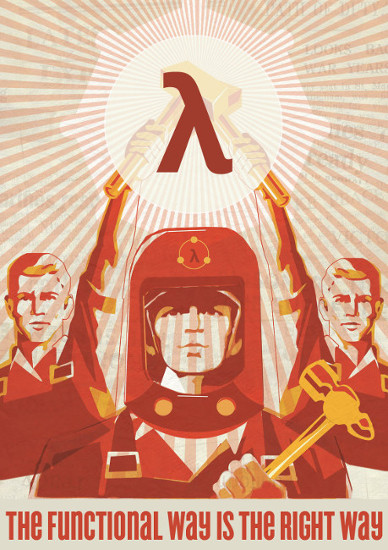

#HSLIDE
### Кой съм аз?

* Аз съм Николай/Meddle. |
* Програмирам сървъри и инфраструктура |
* Работя във ВИК-то |
* Част съм от elixir-lang.bg |
* И други неща... |

#HSLIDE


#HSLIDE
### DISCLAIMER


#HSLIDE
"Силни" и "слаби" типове

* При езиците със слаби типове, операции между различни типове са възможни.

#HSLIDE
```javascript
"5" + 4
//=> "54"

[] + 0
//=> "0"

{} + 4 // !!
//=> 4
```

#HSLIDE


#HSLIDE
```cpp
#include <string>
#include <iostream>

using namespace std;

int main() {
  string s = "bla";
  s += 83;

  cout << s << endl;
}

//=> blaS
```

#HSLIDE
В Erlang това ще доведе до грешка:

```erlang
5 + "4".
```

#HSLIDE
* Това прави Erlang динамично и силно типизиран, както и Elixir, Ruby и Python.
* Примери за статично и силно типизирани езици са Rust, Java, Haskell.

#HSLIDE
### Дефиниции и класификации


#HSLIDE
### Основите

* Алонсо Чърч смята типовете за съществена (intrinsic) част от семантиката (смисъла) на езика. |
* Без типовете зададени като част от изразите езика би се държал неопределено или безмислено. |
* Можем да кажем, че програмата без зададени типове не би могла да се компилира, защото не би имала смисъл за компилатора. |

#HSLIDE
### Основите

* От друга страна ги има и типовете на Хаскел Къри, също известни като несъществени (extrinsic) типове. |
* Тези типове не са част от семантиката на езика, а имат смисъл при самото изпълнение на програмата. |

#HSLIDE
### Основите

* Интересно е, че от толкова рано в развитието на типовете ги има тези две идеи.
* В по-развитите типови ситеми, типовете често не се задават при повечето изрази, защото системата може да си ги изведе (inference).
* Така, че може да се каже, че истината е някъде по средата.


#HSLIDE
### Език

* Имаме си езика, нека е статично типизиран засега, но ще разгледаме и няколко динамични примери. |
* Нямаме никакви типове, имаме бяло платно от типове, нашата работа е да си ги добавим. |
* И добавяйки ги, ще даваме примери на различни езици, ще разширяваме началния си синтаксис. |

#HSLIDE
### Операции над числа
* Нека да си дефинираме операцията за промяна на знака : '-'.
* Това е операция, която взима число и връща число с обърнат знак:

```haskell
let x = 4 :: Integer in -x
-- => -4
```


* В императивни езици като C++ и Java това не беше възможно преди време.

#HSLIDE
### Операции над числа
* Защо в миналото нямаше функции-като-стойности в обектно-ориентирани езици като Java?


#HSLIDE
### Операции над числа
* Какво са класовете в тези езици? Класовете задават структура, по която се създава обект. Нещо като нов тип...

#HSLIDE
### Операции над числа
* Какво са обектите в тези езици? Данни, които могат да променят състоянието си, с операции вързани към тях. Тези операции имат достъп до тези данни, затворени в обекта. Можем да си предаваме обекта насам-натам, предавайки неговите операции и данни.

#HSLIDE
### Операции над числа
* Какво са анонимните функции (ламбдите)? Функции, които може да са обвързани с данни, дали от средата в която са дефинирани, или от начина, по който са построени, които можем да си предаваме насам-натам.

#HSLIDE

